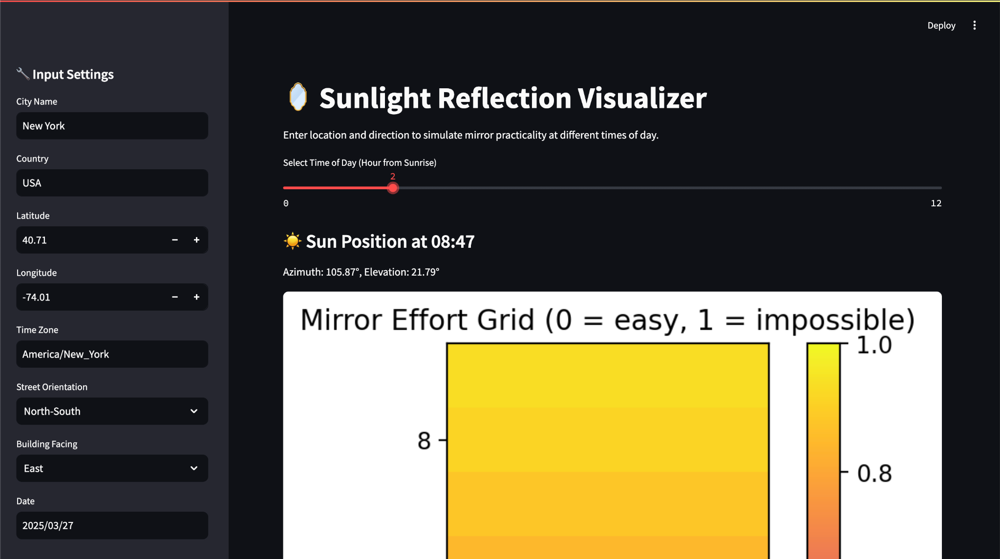

# Sunlight Reflection Visualizer

Our goal is to simulate how sunlight reflects off building windows throughout the day by considering geographic location, date, and building orientation. This pathfinder project aims to develop a sustainable solution for natural, energy-efficient city lighting.

## Usage

- Select city, coordinates, and timezone
- Choose building facing direction and street orientation
- Visualize mirror effort grid (how hard it is to reflect sunlight)
- Determine optimal times for sunlight reflection

## Setup Instructions

1. **Clone the repo**

   ```bash
   git clone https://github.com/Aramii0001/sunlight-project.git
   cd sunlight-project
   ```

2. **Create and activate venv**

   ```
   python -m venv .venv
   source .venv/bin/activate # windows use `.venv\Scripts\activate`
   ```

3. **Install dependencies**

   ```
   pip install -r requirements.txt
   ```

4. **Run the app**
   ```
   streamlit run app.py
   ```

## Preview


